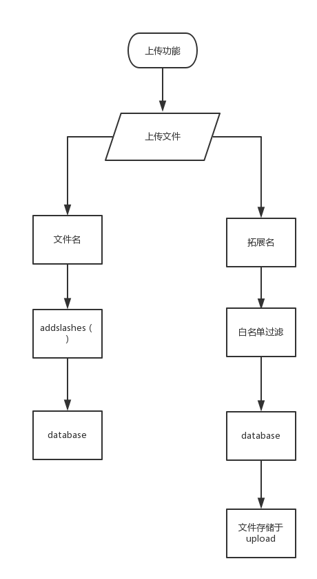
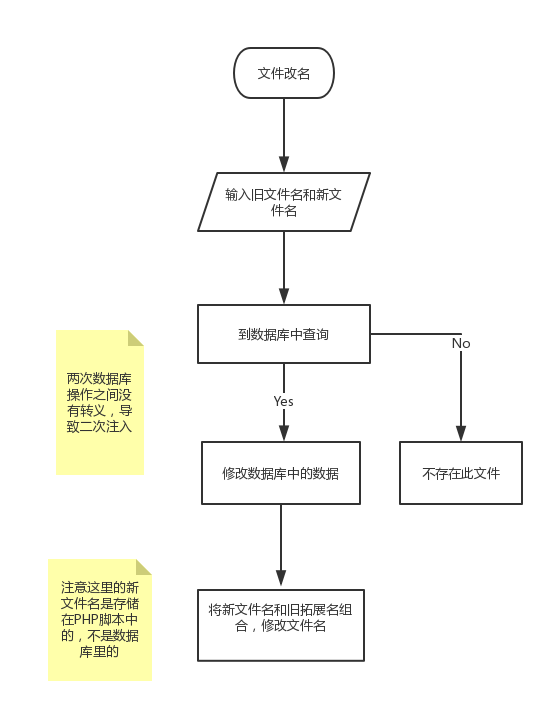
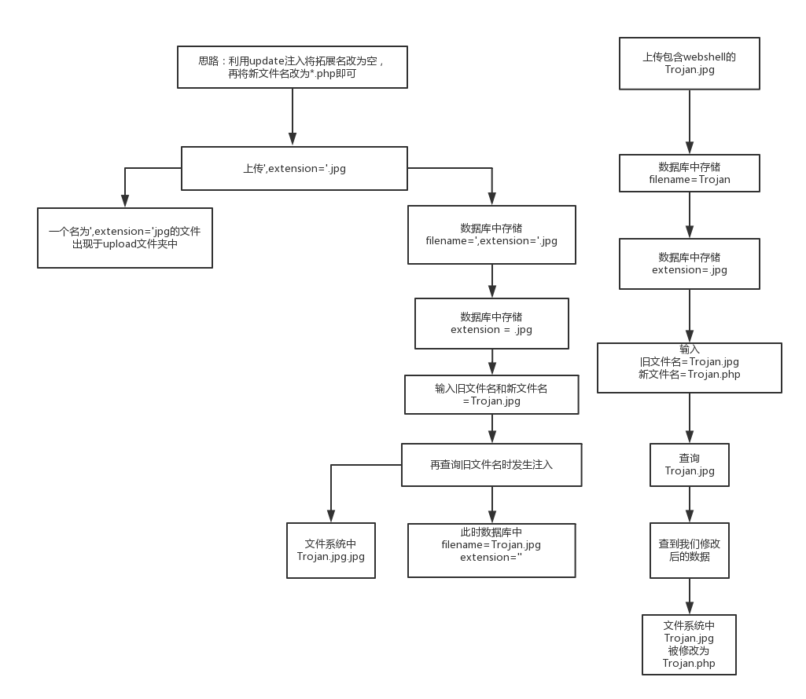

# 心得体会

## 绕过addslashes()的方法
* 宽字节注入
* 二次注入
* url编码，json，base64编码
* 反解压、反转义、数字型

## 代码审计
* 先看common.inc.php这样的全局配置文件
* 上传功能的逻辑

* 改名功能的逻辑

## 思路和构造
思路：利用update注入将拓展名改为空，再将新文件名改为*.php即可

```SQL
update 'file' set 'filename' = '新文件名', 'oldname' = '查询文件名' where 'fid' = fid
update 'flie' set 'filename' = 'Trojan.jpg', 'oldname' = '',extension='' where 'fid' = fid
```

更新语句是用``fid``字段进行定位的，在``rename.php``的``oldname``字段中输入``’,extension=’``由于转义并不能起到注入的效果，但能找到fid。

