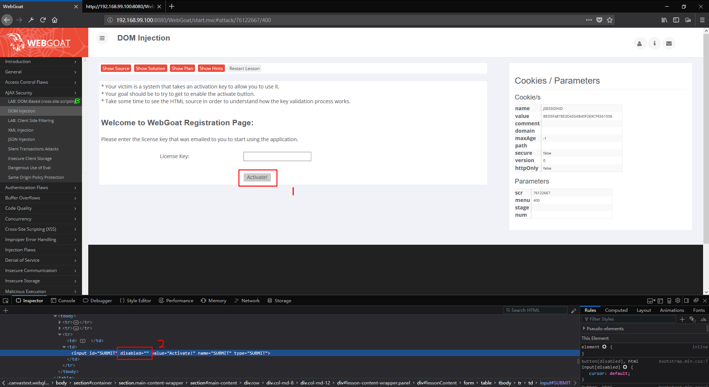

# DOM_Injection
## 技术概念或主题（Concept / Topic To Teach）
How to perform DOM injection attacks. 
## 技术原理（How It works）
Some applications specially the ones that uses AJAX manipulates and updates the DOM directly using JavaScript, DHTML and eval() method.
An attacker may take advantage of that by intercepting the reply and try to inject some javascript commands to exploit his attacks.

 一些应用程序专门使用`` AJAX`` 操控和更新在`` DOM ``中能够直接使用的 ``JavaScript``、``DHTML``和 ``eval()``方法。攻击者可能会利用这一点，通过拦截答复，注入一些`` JavaScript ``命令，实施攻击。
## 总体目标（General Goals）
* Your victim is a system that takes an activation key to allow you to use it.
* Your goal should be to try to get to enable the activate button.
* Take some time to see the HTML source in order to understand how the key validation process works.
## 操作方法（Solutions）
### 官方WP

### 非预期

* Press F12 and select the ``Activate!`` button. Delete the ``disabled = ""``