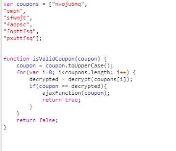
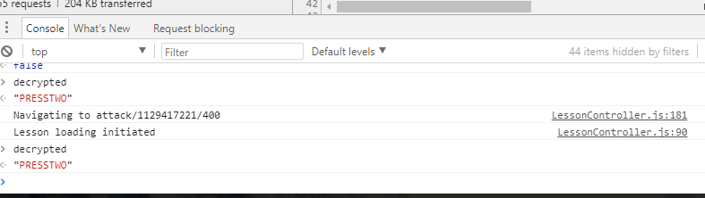
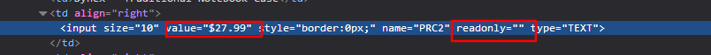

# Insecure_Client_Storage
## STAGE 1

* Audit code and Click on Purchase button.
* Enter ``decrypted`` into console

## STAGE 2

* Press F12 and locate the price element, delete the readonly attribute then modify the price