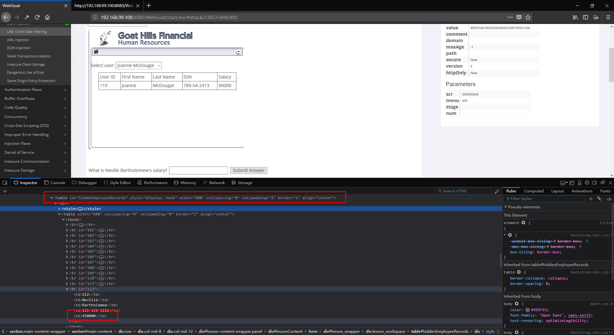
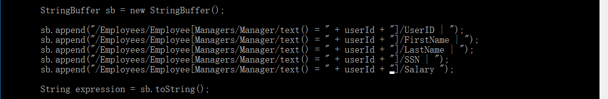

# LAB_Client_Side_Filtering
## STAGE 1

* Press F12 and find ``id="hiddenEmployeeRecords"``, then find ``id="112"``

## STAGE 2

* Find clientSideFiltering.jsp file and modify the fields in the figure as shown below

