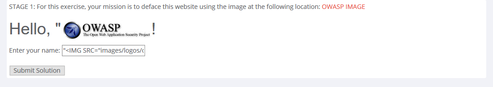
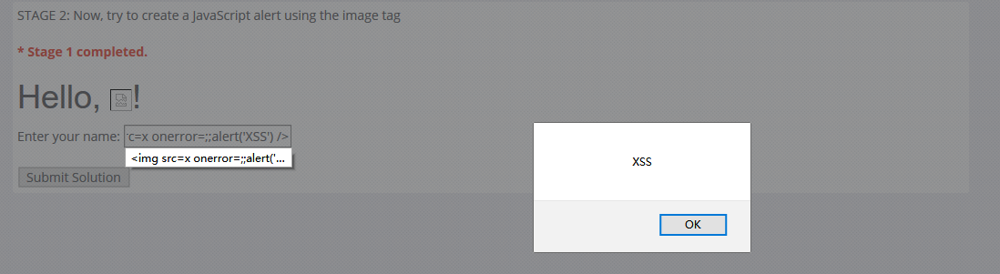
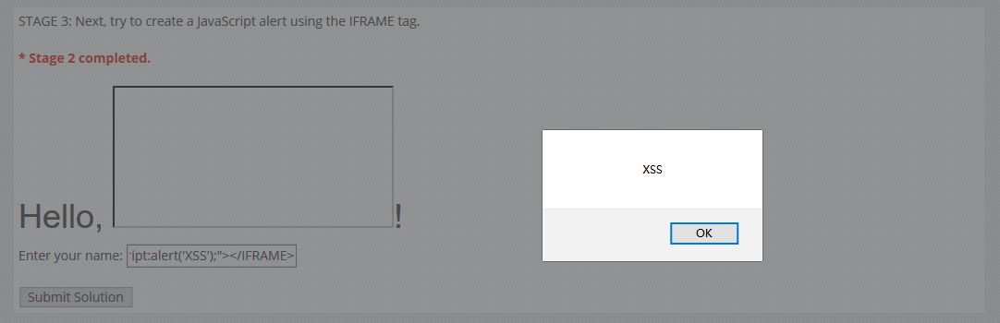
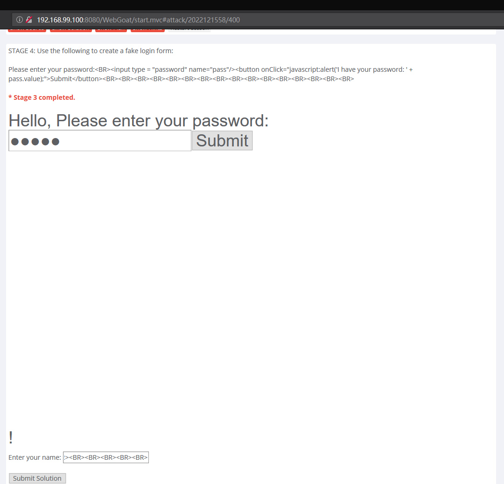
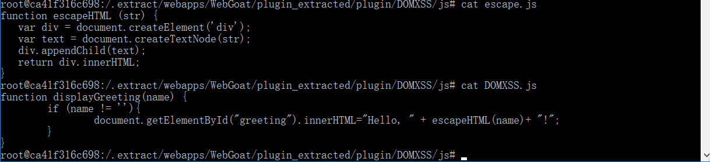
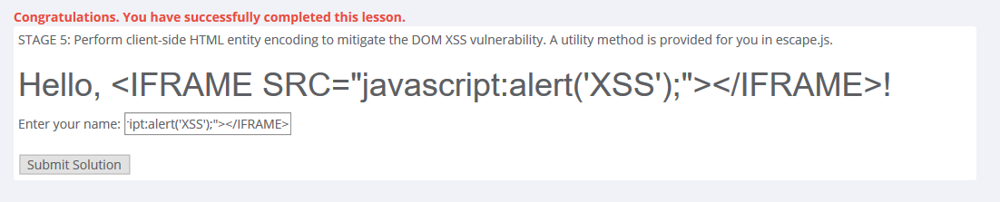

# LAB_DOM-Based_cross-site_scripting
## STAGE 1


* Enter "````" and submit the solution.
## STAGE 2


*  Enter "````" and submit the solution.
## STAGE 3


* Enter "``<IFRAME SRC="javascript:alert('XSS');"></IFRAME>``" and submit the solution.
## STAGE 4


*  Enter "``Please enter your password:<BR><input type = "password" name="pass"/><button onClick="javascript:alert('I have your password: ' + pass.value);">Submit</button><BR><BR><BR><BR><BR><BR><BR><BR> <BR><BR><BR><BR><BR><BR><BR><BR>``" and submit the solution.
## STAGE 5

* Modify ``DOMXSS.js``, add ``escapeHTML()`` in ``name``, ie ``escapeHTML(name)``, then save it.



