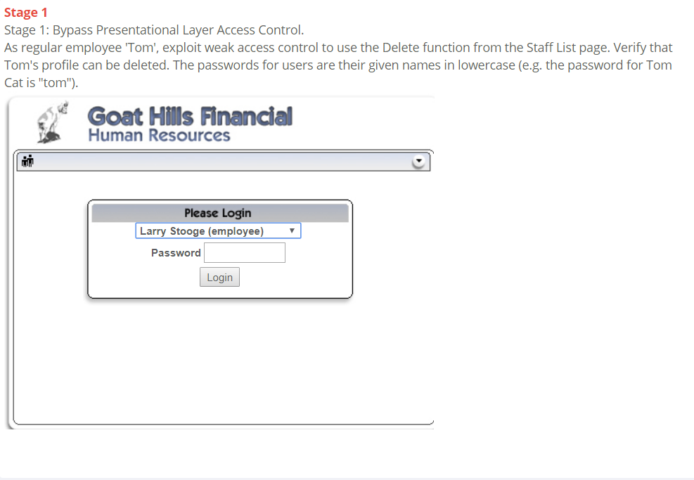
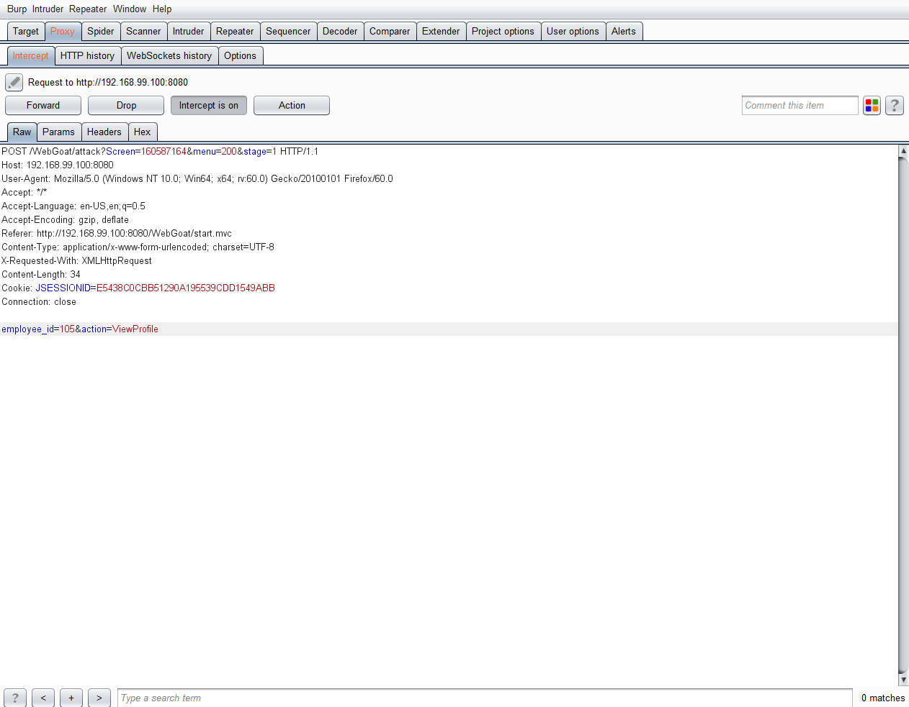
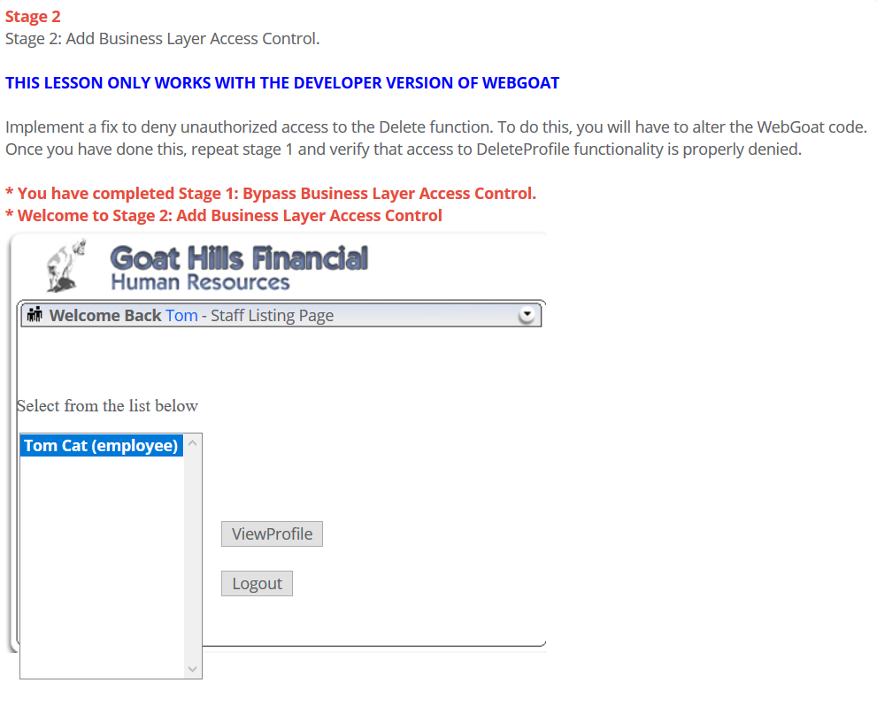
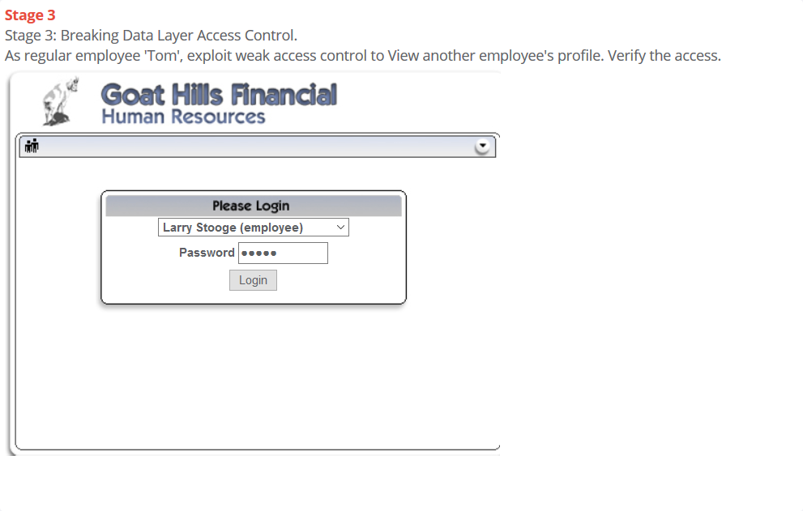
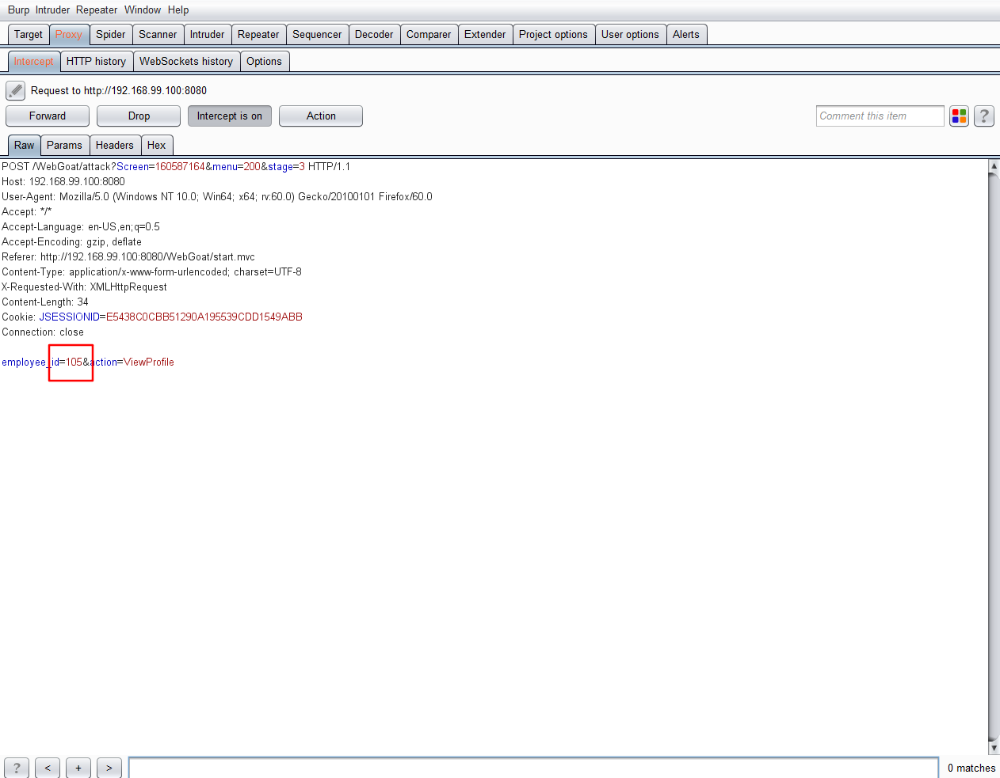
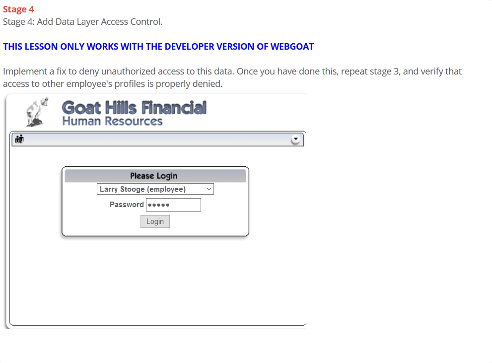

# LAB_Role_Based_Access_Control
## 技术概念或主题（Concept / Topic To Teach）
n role-based access control scheme, a role represents a set of access permissions and privileges. A user can be assigned one or more roles. A role-based access control normally consists of two parts: role permission management and role assignment. A broken role-based access control scheme might allow a user to perform accesses that are not allowed by his/her assigned roles, or somehow obtain unauthorized roles.
## 技术原理（How It works）
很多网站都尝试使用基于角色的方式严格限制资源访问，但开发人员在实现这类解决方
案时容易出现疏忽。
## 总体目标（General Goals）
Your goal is to explore the access control rules that govern this site. Each role has permission to certain resources (A-F). Each user is assigned one or more roles. Only the user with the [Admin] role should have access to the 'F' resources. In a successful attack, a user doesn't have the [Admin] role can access resource F.
## 操作方法（Solutions）
### Stage 1：Bypass_Business_Layer_Access_Control

* 登录进``Tom``的账户，点击``ViewProfile``，抓包。

* 修改``ViewProfile``为``DeleteProfile``

#### 疑问
* Q: ``DeleteProfile``是怎么被发现的？换句话说，我是如何知道要把``ViewProfile``改成``DeleteProfile``而不是其他的单词？
* A1: 代码审计？
* A2: 通过观察管理员的管理界面发现``DeleteProfile``功能
### Stage 2: Add_Business_Layer_Access_Control

### Stage 3: Bypass Data Layer Access Control

* 登录到Tom的账户，点击ViewProfile，抓包

* 修改emloyee_id，来查看其他人的信息
#### 疑问
* Q：我如何知道其他人的id？
* A：爆破？
### Stage 4：Add Data Layer Access Control

### 总结
所谓访问控制缺陷，就是开发人员认为用户不能更改一些参数或输入，因此忽略了这些输入的校验，从而导致用户可以越权操作，造成危害，修补措施当然是对用户的所有输入进行严格校验，反过来想，黑盒测试的时候传入服务器的每一个参数都是一个潜在的利用点。那么如何确认这个点是可以利用的还是不可以利用的，什么时候该花精力绕过，什么时候应该果断放弃，我觉得是最大的问题，而对于白盒审计，追踪参数即可。

