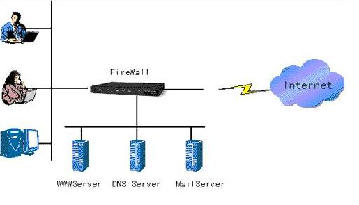
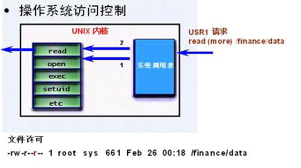
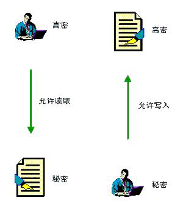
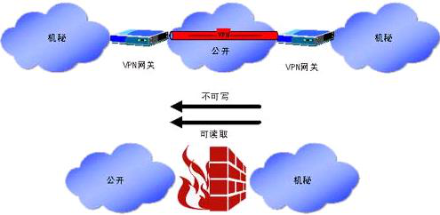
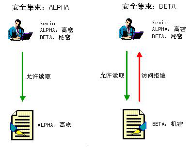
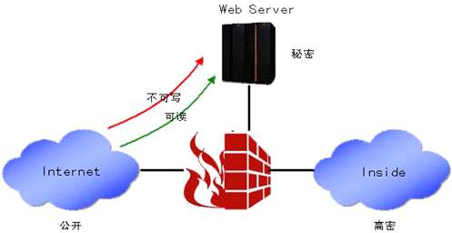
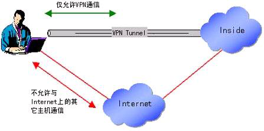

# 访问控制模型二
## 访问控制应用类型

根据应用环境的不同，访问控制主要有以下三种：

* 网络访问控制
* 主机、操作系统访问控制
* 应用程序访问控制

### 网络访问控制

访问控制机制应用在网络安全环境中，主要是限制用户可以建立什么样的连接以及通过网络传输什么样的数据，这就是传统的网络防火墙。防火墙作为网络边界阻塞点来过滤网络会话和数据传输。根据防火墙的性能和功能，这种控制可以达到不同的级别。

防火墙可实现以下几类访问控制：

* 连接控制，控制哪些应用程序终结点之间可建立连接。例如，防火墙可控制内部的某些用户可以发起对外部``WEB``站点间的连接。

* 协议控制，控制用户通过一个应用程序可以进行什么操作，例如，防火墙可以允许用户浏览一个页面，同时拒绝用户在非信任的服务器上发布数据。

* 数据控制，防火墙可以控制应用数据流的通过。如防火墙可以阻塞邮件附件中的病毒。

防火墙实现访问控制的尺度依赖于它所能实现的技术。
### 主机/操作系统访问控制

目前主流的操作系统均提供不同级别的访问控制功能。通常，操作系统借助访问控制机制来限制对文件及系统设备的访问。

例如：``Windows NT/2000``操作系统应用访问控制列表来对本地文件进行保护，访问控制列表指定某个用户可以读、写或执行某个文件。文件的所有者可以改变该文件访问控制列表的属性。
### 应用程序访问控制

访问控制往往嵌入应用程序（或中间件）中以提供更细粒度的数据访问控制。当访问控制需要基于数据记录或更小的数据单元实现时，应用程序将提供其内置的访问控制模型。

例如，大多数数据库（如``Oracle``）都提供独立于操作系统的访问控制机制，``Oracle``使用其内部用户数据库，且数据库中的每个表都有自己的访问控制策略来支配对其记录的访问。

另外比较典型的例子是电子商务应用程序，该程序认证用户的身份并将其置于特定的组中，这些组对应用程序中的某一部分数据拥有访问权限。

## BLP 保密模型
``Bell-LaPadula``保密性模型是第一个能够提供分级别数据机密性保障的安全策略模型（多级安全）。

1973年，``David Bell``和``Len LaPadula``提出了第一个正式的安全模型，该模型基于强制访问控制系统，以敏感度来划分资源的安全级别。将数据划分为多安全级别与敏感度的系统称之为多级安全系统

``Bell-LaPadula`` (``BLP``) 安全模型对主体和客体按照强制访问控制系统的哲学进行分类，这种分类方法一般应用于军事用途。

数据和用户被划分为以下安全等级

* 公开（Unclassified）
* 受限（Restricted）
* 秘密（Confidential）
* 机密（Secret）
* 高密（Top Secret）

``BLP 保密模型``基于两种规则来保障数据的机秘度与敏感度：

* 上读(NRU) , 主体不可读安全级别高于它的数据
* 下写(NWD) , 主体不可写安全级别低于它的数据

　　直接来讲，要考虑数据的保秘性. 例如.假如一个用户，他的安全级别为"高密"，想要访问安全级别为"秘密"的文档，他将能够成功读取该文件，但不能写入；而安全级别为"秘密"的用户访问安全级别为"高密"的文档，则会读取失败，但他能够写入。这样，文档的保秘性就得到了保障。

　　另外，目前不能在原有操作系统中直接进行安全分级。也就是说，在解决其易用性与功能单一性之前，``BLP模型``不能直接用于商业系统。

图为一个用户和资源安全分级的例子。BLP模型允许用户读取安全级别比他低的资源；相反地，写入对象的安全级别只能高于用户级别。简言之，信息系统是一个由低到高的层次化结构。

图示例在通讯过程中如何体现``BLP模型``思想，尽管这种应用在``BLP模型``的实际应用中并不多见。当企业的两个分支网络要跨越非可信网络进行互联时，我们可以为两个网络及其间传输的数据设定虚拟的安全标签，可以假设两个分支机构的安全级别均为"机秘"，而``Internet``，作为``VPN``的传输媒介，它的安全级别为"公开"，因此依照``BLP模型``，Internet上的用户仅可以看到"公开"的数据。而两个分支网络间的数据安全级别为"机秘"，因此，访问控制机制导致Internet用户不能访问"机秘"数据，而这是由于VPN使用了加密技术以实现访问控制机制。

　　另外的一个例子是防火墙所实现的单向访问机制，它不允许敏感数据从内部网络（例如，其安全级别为"机秘"）流向Internet（安全级别为"公开"），所有内部数据被标志为"机密"或"高密"。防火墙提供"上读"功能来阻止Internet对内部网络的访问，提供"下写"功能来限制进入内部的数据流只能经由由内向外发起的连接流入（例如，允许HTTP的"GET"操作而拒绝"POST"操作，或阻止任何外发的邮件）。

## Lattice安全模型

Lattice 模型通过划分安全边界对BLP模型进行了扩充，它将用户和资源进行分类，并允许它们之间交换信息，这是多边安全体系的基础。

　　多边安全的焦点是在不同的安全集束（部门，组织等）间控制信息的流动，而不仅是垂直检验其敏感级别。

　　建立多边安全的基础是为分属不同安全集束的主体划分安全等级，同样在不同安全集束中的客体也必须进行安全等级划分，一个主体可同时从属于多个安全集束，而一个客体仅能位于一个安全集束。

　　在执行访问控制功能时，lattice模型本质上同BLP模型是相同的，而lattice模型更注重形成"安全集束"。BLP模型中的"上读下写"原则在此仍然适用，但前提条件必须是各对象位于相同的安全集束中。主体和客体位于不同的安全集束时不具有可比性，因此在它们中没有信息可以流通。

　　例如，某用户有安全级别为"高密"并从属于安全集束"ALPHA"，另一个安全级别为"机密"的集束"BETA"中的用户试图访问从属于多个安全集束中的文件，若他需要访问集束"ALPHA"中安全级别为"机密"的文件，访问将被允许；而他访问集束"BETA"中的"机密"文件的试图将被拒绝。试图访问集束"GAMMA"中的任何对象都将被拒绝，因为其在集束"GAMMA"中不具有任何安全等级

## Biba完整性模型

七十年代，Ken Biba提出了Biba访问控制模型，该模型对数据提供了分级别的完整性保证，类似于BLP保密性模型，BIBA模型也使用强制访问控制系统。

　　Biba完整性模型对主体和客体按照强制访问控制系统的哲学进行分类，这种分类方法一般应用于军事用途。

　数据和用户被划分为以下安全等级

* 公开（Unclassified）
* 受限（Restricted）
* 秘密（Confidential）
* 机密（Secret）
* 高密（Top Secret）

BIBA模型基于两种规则来保障数据的完整性的保密性。

* 下读(NRU) 属性, 主体不能读取安全级别低于它的数据
* 上写(NWD) 属性, 主体不能写入安全级别高于它的数据
　　从这两个属性来看，我们发现Biba与BLP模型的两个属性是相反的，BLP模型提供保密性，而BIBA模型对于数据的完整性提供保障。

　　BIBA模型并没有被用来设计安全操作系统，但大多数完整性保障机制都基于Biba模型的两个基本属性构建。

　　如图，一个安全级别为"机密"的用户要访问级别为"秘密"的文档，他将被允许写入该文档，而不能读取。如果他试图访问"高密"级的文档，那么，读取操作将被允许，而写入操作将被拒绝。这样，就使资源的完整性得到了保障。

　　因此，只有用户的安全级别高于资源的安全级别时可对资源进行写操作，相反地，只有用户的安全级别低于资源的安全经别时可读取该资源。简而言之，信息在系统中只能自上而下进行流动。

### 应用举例

Biba模型在应用中的一个例子是对WEB服务器的访问过程。如图，定义Web服务器上发布的资源安全级别为"秘密"，Internet上用户的安全级别为"公开"，依照Biba模型，Web服务器上数据的完整性将得到保障，Internet上的用户只能读取服务器上的数据而不能更改它，因此，任何"POST"操作将被拒绝。

　　另一个例子是对系统状态信息的收集，网络设备作为对象，被分配的安全等级为"机密"，网管工作站的安全级别为"秘密"，那么网管工作站将只能使用SNMP的"get"命令来收集网络设备的状态信息，而不能使用"set"命令来更改该设备的设置。这样，网络设备的配置完整性就得到了保障。

## Clark Wilson完整性模型
Clark-Wilson数据完整性安全模型是在1987年被提出的，通常被用在银行系统中来保证数据的完整性，该模型略显复杂，是为现代数据存储技术量身定制的。

　　Clark Wilson完整性模型经常应用在银行应用中以保证数据完整性，它的实现基于成形的事务处理机制。

* 系统接受"自由数据条目 (UDI)"并将其转换为 "受限数据条目 (CDI)"
* "受限数据条目 (CDI)"仅能被"转换程序（TP）"所改变
* "转换程序 (TP)" 保证"受限数据条目 

CDI"的完整性

* 每个受限数据条目(CDI) 拥有一个完整性检查程序 (IVP)
* 访问控制机制由三个元素组成 (主体, TP, CDI)
### 应用举例

图所示为Clark Wilson完整性模型在电子商务程序中的应用，用户接到自主数据条目（UDI）并由转换程序（TP）将其转换为受限数据条目（CDI）CDI1，CDI1用来更新CDI2（例如客户的订单）和CDI3（如客户的帐单），完整性检查程序（IVP）总是要检查是否CDI2（订单）和CDI3（帐单）是否出入平衡，因此可确保整个交易的完整性。

## Chinese Wall模型

Chinese Wall模型是应用在多边安全系统中的安全模型（也就是多个组织间的访问控制系统），应用在可能存在利益冲突的组织中。最初是为投资银行设计的，但也可应用在其它相似的场合。

Chinese Wall安全策略的基础是客户访问的信息不会与目前他们可支配的信息产生冲突。在投资银行中，一个银行会同时拥有多个互为竞争者的客户，一个银行家可能为一个客户工作，但他可以访问所有客户的信息。因此，应当制止该银行家访问其它客户的数据。

Chinese Wall安全模型的两个主要属性：

* 用户必须选择一个他可以访问的区域
* 用户必须自动拒绝来自其它与用户所选区域的利益冲突区域的访问
　　这种模型同时包括了DAC和MAC的属性：银行家可以选择为谁工作（DAC），但是一旦选定，他就被只能为该客户工作（MAC）。

### 应用示例

Chinese Wall安全模型在网络安全体系中应用的一个典型的例子是位于防火墙内部的一台服务器，连接着内部与外部网络。假如策略禁止经由此服务器转发数据，该服务器将曝露于外部网络（也就是说，该服务器仅能与外部网络通讯，而不能与内部网络通讯）

　另外用远程访问VPN来举例说明，位于Internet上的用户与内部网络建立VPN会话之后。依照中国墙安全模型所建议，在任何时候，用户或与Internet通讯，或与公司网络进行通讯，二者只可选其一（也就是说：隧道不可分割）

　　单向会话只发生在有限的时间内，本安全模型的核心在于--用户选择与其中一方进行通讯，则放弃了与另一方会话的权利。

