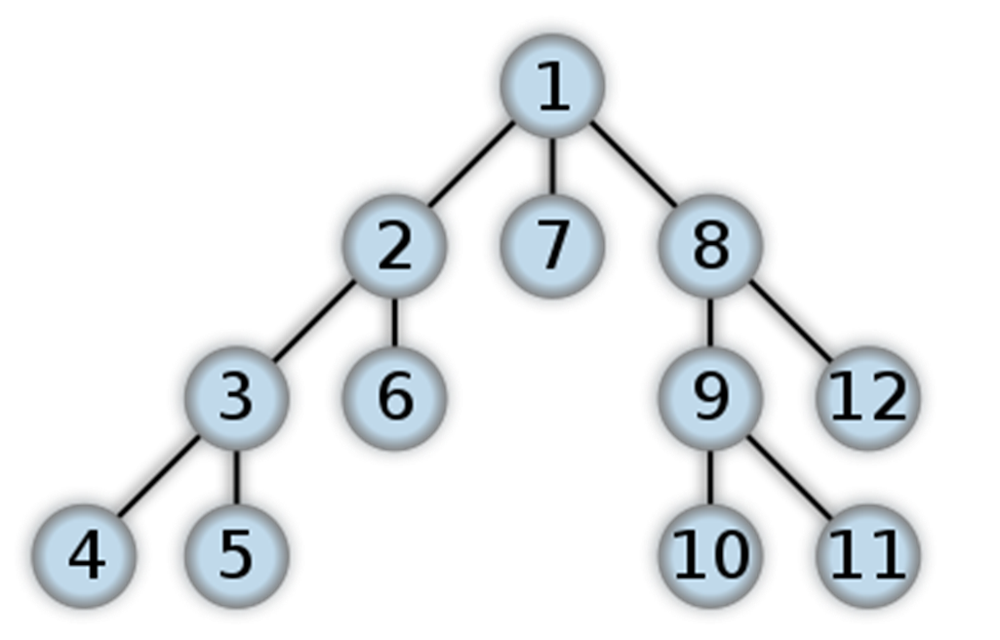
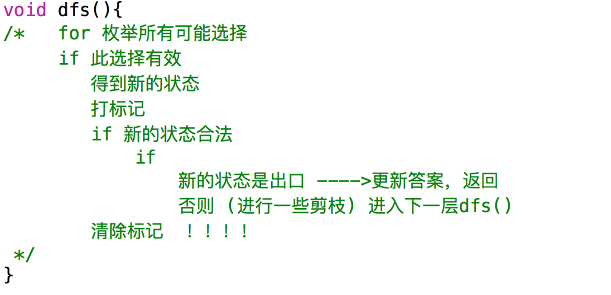

# 深度优先搜索
## 简单介绍
* （Depth-First-Search，简称DFS）
* 是一种用于遍历或搜索树或图的算法。
* 沿着树的深度遍历树的节点，尽可能深的搜索树的分支。
* 当节点v的所在边都己被探寻过，搜索将回溯到发现节点v的那条边的起始节点。
* 这一过程一直进行到已发现从源节点可达的所有节点为止。
* 如果还存在未被发现的节点，则选择其中一个作为源节点并重复以上过程，整个进程反复进行直到所有节点都被访问为止。
* 属于盲目搜索。

## 深搜的代码模板

## 一些常用的剪枝
### 正确性
  正如上文所述,枝条不是爱剪就能剪的. 如果随便剪枝,把带有最优解的那一分支也剪掉了的话,剪枝也就失去了意义. 所以,剪枝的前提是一定要保证不丢失正确的结果.
### 准确性
  在保证了正确性的基础上,我们应该根据具体问题具体分析,采用合适的判断手段,使不包含最优解的枝条尽可能多的被剪去,以达到程序“最优化”的目的. 可以说,剪枝的准确性,是衡量一个优化算法好坏的标准.
### 高效性
设计优化程序的根本目的,是要减少搜索的次数,使程序运行的时间减少. 但为了使搜索次数尽可能的减少,我们又必须花工夫设计出一个准确性较高的优化算法,而当算法的准确性升高,其判断的次数必定增多,从而又导致耗时的增多,这便引出了矛盾.

* 可行性剪枝
* 该方法判断继续搜索能否得出答案，如果不能直接回溯。
* 最优性剪枝.
* 它记录当前得到的最优值，如果当前结点已经无法产生比当前最优解更优的解时，可以提前回溯。

